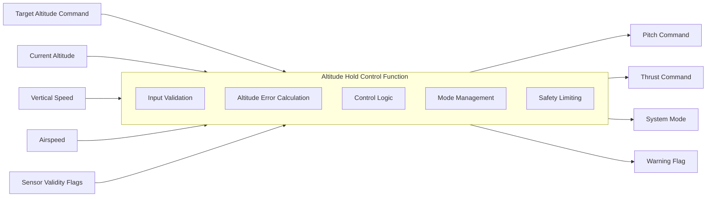

# System Block Diagram

This diagram shows the high-level system boundary for the Simplified Flight Control System — Altitude Hold Function.

## System Boundary

The Altitude Hold Control Function is treated as the System Under Test.

Inputs such as aircraft state data and sensor validity flags are received from external systems. The function validates these inputs, calculates altitude error, applies control logic, manages system mode, and outputs pitch/thrust commands with warning status.

## Notes

This diagram is intentionally simplified. It does not represent a real aircraft architecture or Airbus A320 flight control implementation.
